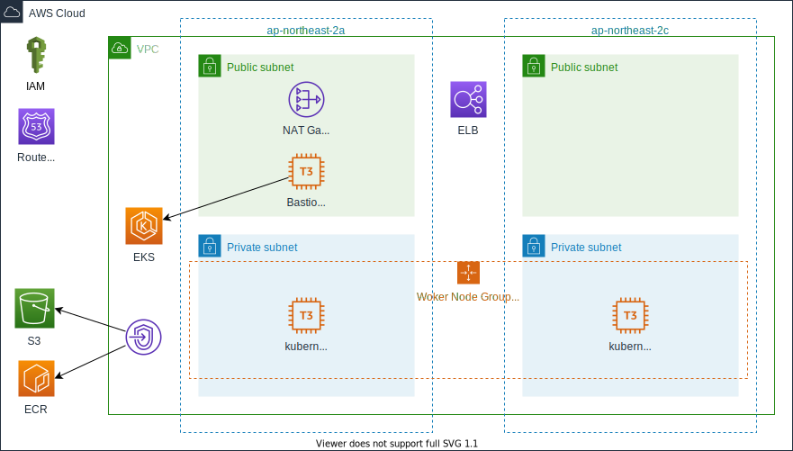
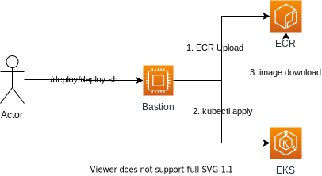
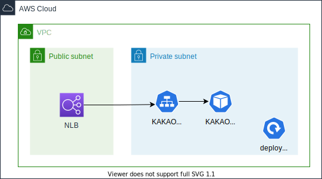

# kakomobility 과제 전형

# 다이어그램

# 코드 구성
| folder | 설명 |
|--------|------|
| eks | terraform 구성 코드 |
| kakaomobility | Hostname Return Program |

# eks 코드
실행 방법 : terraform apply -var-file configuration

### 구성 설명
| folder | 설명 |
|--------|-----|
|az      | ap-northeast-2a,ap-northeast-2c  |
|subnet  | Public, Private subnet  |
|ec2     | bastion host 사용(kubectl 및 deploy용도)  |
|eks     | 프라이빗, 퍼블릭 액세스 사용, node는 private subnet 위치 |
|vpc private link | 프라이빗 클러스터 구성으로 eks 사용에 필요한 엔드포인트 생성 |

# kakaomobility 코드
사전 준비
* ECR Auth

| Auth | 
|------|
|ecr:GetAuthorizationToken|
|ecr:InitiateLayerUpload|
|ecr:UploadLayerPart|
|ecr:CompleteLayerUpload|
|ecr:BatchCheckLayerAvailability|
|ecr:PutImage|

실행 스크립트 : ./deploy/deploy.sh

k8s 구성  

## Terraform 상세 구성
## Providers
| Name | Version |
|------|---------|
|  [aws](#provider\_aws) | >= 3.48.0 |
|  [kubernetes](#provider\_kubernetes) | >= 1.11.1 |

## Modules
| Name | Source | Version |
|------|--------|---------|
|eks| terraform-aws-eks | 17.1.0 |

# Resources
|Name|Type|
|------|---|
|aws_caller_identity.current|data|
|aws_eks_cluster.cluster|data|
|aws_eks_cluster_auth.cluster|data|
|template_file.user_data|data|
|aws_ecr_repository.kakaomobility_app|resource|
|aws_eip.nat_eip|resource|
|aws_iam_instance_profile.bastion_profile|resource|        
|aws_iam_policy.master_policy|resource|
|aws_iam_role.master_role|resource|
|aws_instance.bastion|resource|
|aws_internet_gateway.igw|resource|
|aws_nat_gateway.nat_pri_1|resource|
|aws_route.pri_nat_rule|resource|
|aws_route.pub_igw_rule|resource|
|aws_route_table.pri_rt|resource|
|aws_route_table.pub_rt|resource|
|aws_route_table_association.pri_sub1_association|resource|
|aws_route_table_association.pri_sub2_association|resource|
|aws_route_table_association.pub_sub1_association|resource|
|aws_route_table_association.pub_sub2_association|resource|
|aws_security_group.bastion_sg|resource|
|aws_security_group.endpoint_sg|resource|
|aws_security_group.workernode_sg|resource|
|aws_security_group_rule.ing_bastion_ssh_rule|resource|    
|aws_security_group_rule.ing_eks_cluster_rule|resource|    
|aws_security_group_rule.ing_workernode_ssh_rule |resource|
|aws_subnet.private_subnet_1|resource|
|aws_subnet.private_subnet_2|resource|
|aws_subnet.public_subnet_1|resource|
|aws_subnet.public_subnet_2|resource|
|aws_vpc.vpc|resource|
|aws_vpc_endpoint.autoscaling_endpoint|resource|
|aws_vpc_endpoint.ec2-endpoint|resource|
|aws_vpc_endpoint.ecr-api-endpoint|resource|
|aws_vpc_endpoint.ecr-endpoint|resource|
|aws_vpc_endpoint.elasticloadbalancing_endpoint|resource|
|aws_vpc_endpoint.log-endpoint|resource|
|aws_vpc_endpoint.s3-endpoint|resource|
|aws_vpc_endpoint.sts-endpoint|resource|
|module.eks.data.aws_caller_identity.current|data|
|module.eks.data.aws_iam_policy_document.cluster_assume_role_policy|data|
|module.eks.data.aws_iam_policy_document.cluster_elb_sl_role_creation[0]|data|
|module.eks.data.aws_iam_policy_document.workers_assume_role_policy|data|
|module.eks.data.aws_partition.current|data|
|module.eks.data.http.wait_for_cluster[0]|data|
|module.eks.aws_cloudwatch_log_group.this[0]|resource|
|module.eks.aws_eks_cluster.this[0]|resource|
|module.eks.aws_iam_policy.cluster_elb_sl_role_creation[0]|resource|
|module.eks.aws_iam_role.cluster[0]|resource|
|module.eks.aws_iam_role.workers[0]|resource|
|module.eks.aws_iam_role_policy_attachment.cluster_AmazonEKSClusterPolicy[0]|resource|
|module.eks.aws_iam_role_policy_attachment.cluster_AmazonEKSServicePolicy[0]|resource|
|module.eks.aws_iam_role_policy_attachment.cluster_AmazonEKSVPCResourceControllerPolicy[0]|resource|
|module.eks.aws_iam_role_policy_attachment.cluster_elb_sl_role_creation[0]|resource|
|module.eks.aws_iam_role_policy_attachment.workers_AmazonEC2ContainerRegistryReadOnly[0]|resource|
|module.eks.aws_iam_role_policy_attachment.workers_AmazonEKSWorkerNodePolicy[0]|resource|
|module.eks.aws_iam_role_policy_attachment.workers_AmazonEKS_CNI_Policy[0]|resource|
|module.eks.aws_security_group.cluster[0]|resource|
|module.eks.aws_security_group.workers[0]|resource|
|module.eks.aws_security_group_rule.cluster_egress_internet[0]|resource|
|module.eks.aws_security_group_rule.cluster_https_worker_ingress[0]|resource|
|module.eks.aws_security_group_rule.workers_egress_internet[0]|resource|
|module.eks.aws_security_group_rule.workers_ingress_cluster[0]|resource|
|module.eks.aws_security_group_rule.workers_ingress_cluster_https[0]|resource|
|module.eks.aws_security_group_rule.workers_ingress_self[0]|resource|
|module.eks.kubernetes_config_map.aws_auth[0]|resource|
|module.eks.local_file.kubeconfig[0]|resource|
|module.eks.module.node_groups.aws_eks_node_group.workers["kakaomobility-eks-group"]|resource|
